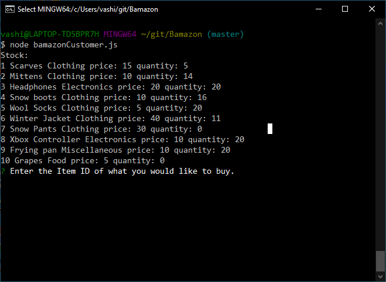
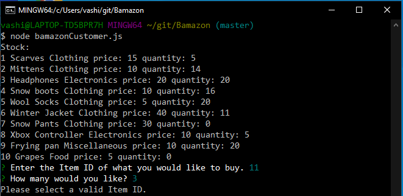
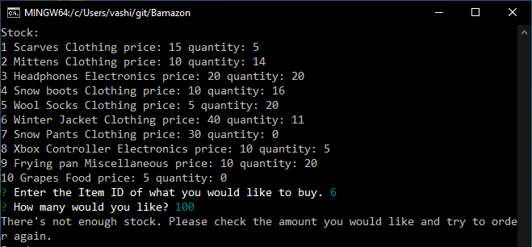
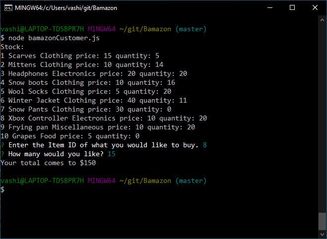

# Bamazon

This Project is using node and mysql to diplay a set a data as a table to a customer facing UI. The user just needs to select the item ID they'd like and type the amount of the item that they would like as well. after selections it will inform the user of the amount for the item selected with the quantity and will allow the user to start the process over again.

This is what you would see upon start with the selections to make.

This is the error you would see after making an incorrect selection from the table.

This is the error you would see upon selecting more than the quantity of the item.

After filling out what you want and the amount you need that does not exceed what the shop has it will say how much it costs and finish the checkout.

